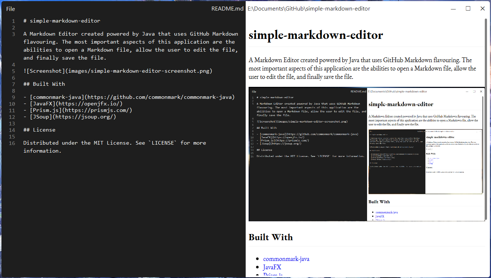

# simple-markdown-editor

A Markdown Editor created powered by Java that uses GitHub Markdown flavouring. The most important aspects of this application are the abilities to open a Markdown file, allow the user to edit the file, and finally save the file.

## Built With

- [commonmark-java](https://github.com/commonmark/commonmark-java)
- [JavaFX](https://openjfx.io/)
- [Prism.js](https://prismjs.com/)
- [JSoup](https://jsoup.org/)

## License

Distributed under the MIT License. See `LICENSE` for more information.